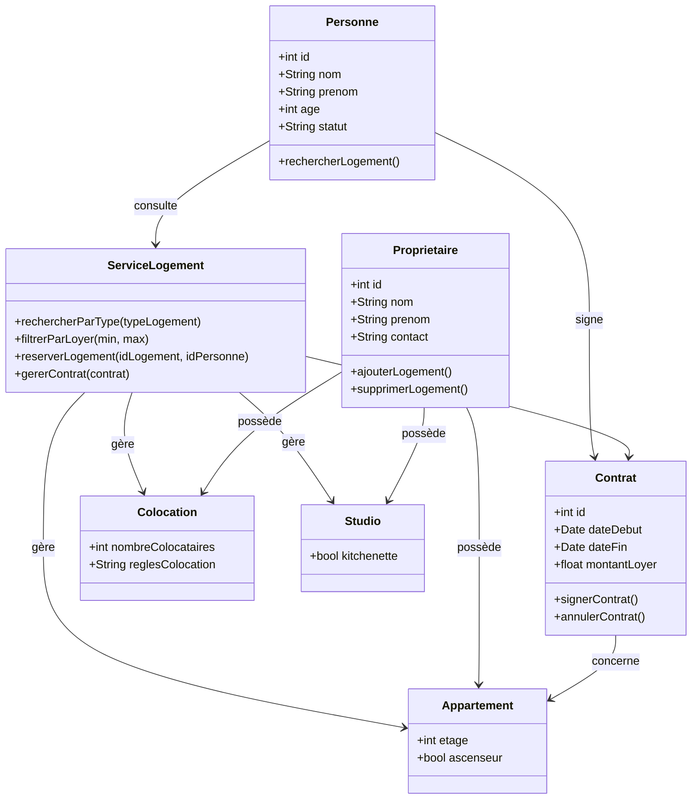

```mermaid
classDiagram

    %% ============================
    %%        CLASSES
    %% ============================

    class ServiceLogement {
        +rechercherParType(typeLogement)
        +filtrerParLoyer(min, max)
        +reserverLogement(idLogement, idPersonne)
        +gererContrat(contrat)
    }

    class Personne {
        +int id
        +String nom
        +String prenom
        +int age
        +String statut
        +rechercherLogement()
    }

    class Proprietaire {
        +int id
        +String nom
        +String prenom
        +String contact
        +ajouterLogement()
        +supprimerLogement()
    }

    class Contrat {
        +int id
        +Date dateDebut
        +Date dateFin
        +float montantLoyer
        +signerContrat()
        +annulerContrat()
    }

    class Colocation {
        +int nombreColocataires
        +String reglesColocation
    }

    class Studio {
        +bool kitchenette
    }

    class Appartement {
        +int etage
        +bool ascenseur
    }

    %% ============================
    %%        RELATIONS
    %% ============================

    %% ServiceLogement gère les logements
    ServiceLogement --> Colocation : gère
    ServiceLogement --> Studio : gère
    ServiceLogement --> Appartement : gère

    %% Propriétaire possède les logements
    Proprietaire --> Colocation : possède
    Proprietaire --> Studio : possède
    Proprietaire --> Appartement : possède

    %% Personne recherche un logement via ServiceLogement
    Personne --> ServiceLogement : consulte

    %% Personne signe un contrat
    Personne --> Contrat : signe

    %% Contrat lié au logement (relation floue vue sur la photo)
    Contrat --> Appartement : concerne

    %% Contrat généré par ServiceLogement
    ServiceLogement --> Contrat : génère
```
